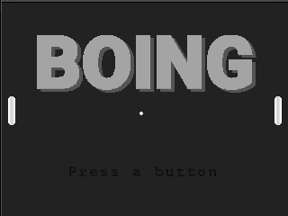

# Boing 

Boing is a cross-platform a block-breaking game developed by [Modus Create](https://moduscreate.com) and its sole purpose is to demonstrate how to use [creative engine](https://github.com/moduscreateorg/creative-engine). Boing runs on the [ODROID GO](https://www.hardkernel.com/shop/odroid-go/), macOS and Linux.

## How to Play
Biong is a simple game where you have to outsmart your AI opponent and land the ball behind his paddle. 

## Getting started
To build Boing, please follow the [Getting Started](./md/DEVELOPING.md#getting-started) in our [developer guide](./md/DEVELOPING.md).

## Keymap for computer-based players:

#### Global (all screens)
| Key(s) | Description |
| --- | --- |
| `Q` | Quits the game |

#### Main Menu
| Key(s) | Description |
| --- | --- |
| `4` `RETURN` `X` `Z` `SPACE` | Start the game |

### Game
| Key(s) | Description |
| --- | --- |
|`↑ ↓` | Moves the paddle |
|`2` | Mute / Un-mute sounds |

## License
Boing is licensed under [MIT](https://opensource.org/licenses/MIT).

# Contributing
Interested in contributing to Boing? Please see our [developing](./md/DEVELOPING.md) and [contributions](./md/CONTRIBUTIONS.MD) guidelines. 
